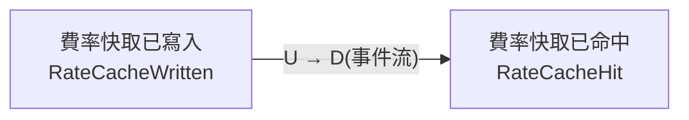
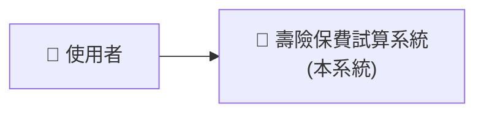
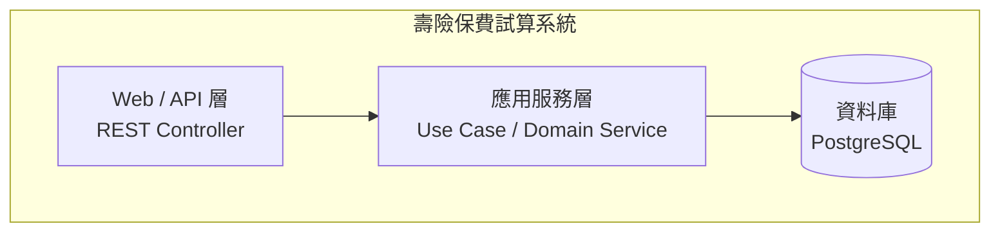
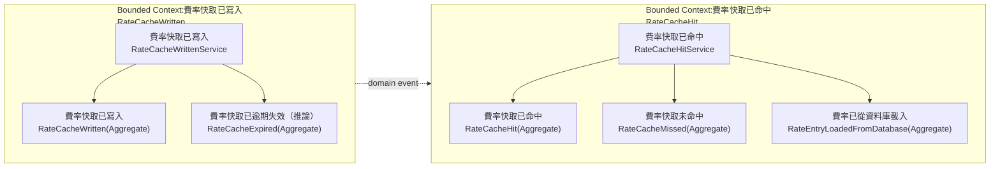
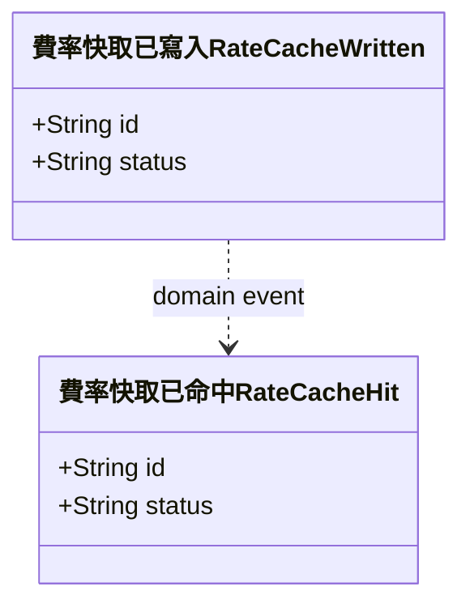
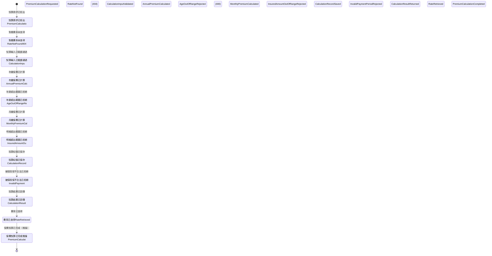
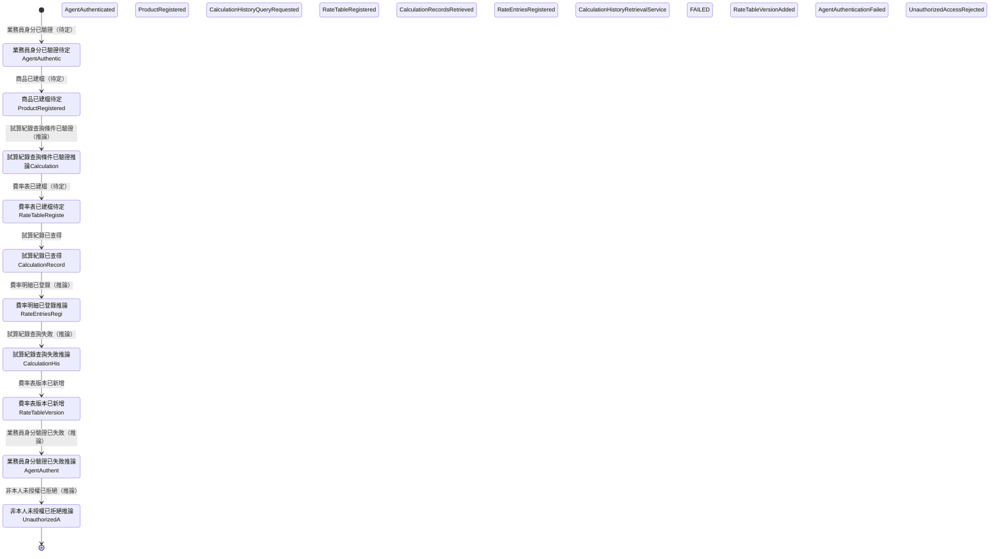
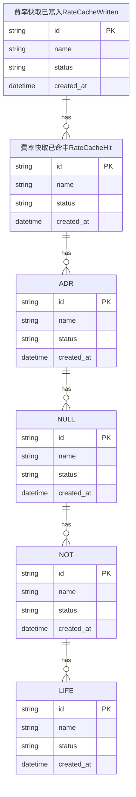

# 壽險保費試算系統

> 本文件由 SDLC Agentic Platform 於**業務需求與技術需求皆經人工確認後**自動產出/更新(application type:JAVA_BACKEND);測試案例階段確認後會再補入技術層級測試情境。

## 1. 分析方法與流程

本專案的架構文件依循以下推導鏈,每一步的產物都是下一步的輸入:


- **事件風暴**:從業務輸入(白板/看板/文件)辨識 domain event(領域中已發生的事實)、command(觸發動作)、actor、policy、外部系統,依便利貼顏色語彙分類、依空間分佈分群出 bounded context。
- **Context Mapping**:以事件流方向排出 context 間的上下游(U→D)關係,並標註與外部系統的整合點。
- **C4 / UML / ER**:由上述分析**機械式推導**——類別=aggregate、方法=command、循序=command→event(各 context 一張 + 跨 context **端對端 E2E** 一張)、狀態=事件序、ER=aggregate 與實體。

## 2. 事件風暴分析(Event Storming)

> 來源:photo;顏色語彙依 eventstorming.com——🟧 Domain Event(過去式事實)、🟦 Command、🟨 Actor/Aggregate、🟪 Policy(每當…則…)、🩷 外部系統、🟥 Hotspot(待釐清)。

辨識出 **2 個 bounded context**、22 個 domain event。

### 2.1 Bounded Context:費率快取已寫入
RateCacheWritten

| 元素 | 內容 |
|---|---|
| 🟧 Domain Events | 試算請求已拒出
PremiumCalculationRequested、對應費率未查得
RateNotFound
(404)、試算輸入已驗證通過
CalculationInputValidated、年繳保費已計算
AnnualPremiumCalculated、年齡超出範圍已拒絕
AgeOutOfRangeRejected
(400)、月繳保費已計算
MonthlyPremiumCalculated、明細超出範圍已拒絕
InsuredAmountOutOfRangeRejected
(400)、試算紀錄已保存
CalculationRecordSaved、被保投保不合法已拒絕
InvalidPaymentPeriodRejected
(400)、試算結果已回傳
CalculationResultReturned、費率已查得
RateRetrieved、保費試算已完成（推論）
PremiumCalculationCompleted |
| 🟨 Aggregates | 費率快取已寫入
RateCacheWritten、費率快取已逾期失效（推論）
RateCacheExpired |

### 2.2 Bounded Context:費率快取已命中
RateCacheHit

| 元素 | 內容 |
|---|---|
| 🟧 Domain Events | 業務員身分已驗證（待定）
AgentAuthenticated、商品已建檔（待定）
ProductRegistered、試算紀錄查詢條件已驗證（推論）
CalculationHistoryQueryRequested、費率表已建檔（待定）
RateTableRegistered、試算紀錄已查得
CalculationRecordsRetrieved、費率明細已登錄（推論）
RateEntriesRegistered、試算紀錄查詢失敗（推論）
CalculationHistoryRetrievalService
FAILED、費率表版本已新增
RateTableVersionAdded、業務員身分驗證已失敗（推論）
AgentAuthenticationFailed、非本人未授權已拒絕（推論）
UnauthorizedAccessRejected |
| 🟨 Aggregates | 費率快取已命中
RateCacheHit、費率快取未命中
RateCacheMissed、費率已從資料庫載入
RateEntryLoadedFromDatabase |

### 事件流(時間軸)

依白板/看板的空間順序還原的完整事件流:

`試算請求已拒出
PremiumCalculationRequested` → `對應費率未查得
RateNotFound
(404)` → `試算輸入已驗證通過
CalculationInputValidated` → `年繳保費已計算
AnnualPremiumCalculated` → `年齡超出範圍已拒絕
AgeOutOfRangeRejected
(400)` → `月繳保費已計算
MonthlyPremiumCalculated` → `明細超出範圍已拒絕
InsuredAmountOutOfRangeRejected
(400)` → `試算紀錄已保存
CalculationRecordSaved` → `被保投保不合法已拒絕
InvalidPaymentPeriodRejected
(400)` → `試算結果已回傳
CalculationResultReturned` → `費率已查得
RateRetrieved` → `保費試算已完成（推論）
PremiumCalculationCompleted` → `業務員身分已驗證（待定）
AgentAuthenticated` → `商品已建檔（待定）
ProductRegistered` → `試算紀錄查詢條件已驗證（推論）
CalculationHistoryQueryRequested` → `費率表已建檔（待定）
RateTableRegistered` → `試算紀錄已查得
CalculationRecordsRetrieved` → `費率明細已登錄（推論）
RateEntriesRegistered` → `試算紀錄查詢失敗（推論）
CalculationHistoryRetrievalService
FAILED` → `費率表版本已新增
RateTableVersionAdded` → `業務員身分驗證已失敗（推論）
AgentAuthenticationFailed` → `非本人未授權已拒絕（推論）
UnauthorizedAccessRejected`

## 3. Context Mapping

**說明**:依事件流方向,上游(U)context 的 domain event 驅動下游(D)context 的行為;與外部系統的整合建議以防腐層(ACL)隔離,避免外部模型滲入領域。



| 上游(U) | 下游(D) | 關係依據 |
|---|---|---|
| 費率快取已寫入
RateCacheWritten | 費率快取已命中
RateCacheHit | 事件「保費試算已完成（推論）
PremiumCalculationCompleted」觸發下游流程 |

## 4. C4 Model

### L1 系統情境圖(System Context)

**說明**:系統與使用者、外部系統的邊界——誰在用、依賴誰。actor 與外部系統取自事件風暴的 🟨/🩷 便利貼。



### L2 容器圖(Container)

**說明**:系統內部的可部署單元與資料流;採技術需求確認的三層式架構(Web/API → 應用服務 → 資料庫),外部系統經應用服務層整合。



### L3 元件圖(Component)

**說明**:應用服務層內部——**以 bounded context 為元件邊界**(一個 context 一個 Service + 其 Aggregate),context 間僅以 domain event 溝通。



## 5. UML

### 類別圖(Class Diagram)

**說明**:每個 bounded context 的 aggregate 對應一個類別;事件風暴的 🟦 command 直接成為該類別的公開方法(行為即介面)。



### 循序圖(Sequence Diagram)

**說明**:由事件風暴的 command→event 流逐一還原——actor 發出 command,服務落地後回應 domain event;🟪 policy 以備註標在對應服務上。各 context 一張,最後附**跨 context 的端對端 E2E 圖**。

#### 費率快取已寫入
RateCacheWritten
```mermaid
sequenceDiagram
    actor 使用者
    participant 費率快取已寫入RateCacheWrittenService
    participant DB
    費率快取已寫入RateCacheWrittenService->>DB: 寫入/查詢
    費率快取已寫入RateCacheWrittenService-->>使用者: 事件:試算請求已拒出
PremiumCalculationRequested
    費率快取已寫入RateCacheWrittenService->>DB: 寫入/查詢
    費率快取已寫入RateCacheWrittenService-->>使用者: 事件:對應費率未查得
RateNotFound
(404)
    費率快取已寫入RateCacheWrittenService->>DB: 寫入/查詢
    費率快取已寫入RateCacheWrittenService-->>使用者: 事件:試算輸入已驗證通過
CalculationInputValidated
    費率快取已寫入RateCacheWrittenService->>DB: 寫入/查詢
    費率快取已寫入RateCacheWrittenService-->>使用者: 事件:年繳保費已計算
AnnualPremiumCalculated
    費率快取已寫入RateCacheWrittenService->>DB: 寫入/查詢
    費率快取已寫入RateCacheWrittenService-->>使用者: 事件:年齡超出範圍已拒絕
AgeOutOfRangeRejected
(400)
    費率快取已寫入RateCacheWrittenService->>DB: 寫入/查詢
    費率快取已寫入RateCacheWrittenService-->>使用者: 事件:月繳保費已計算
MonthlyPremiumCalculated
    費率快取已寫入RateCacheWrittenService->>DB: 寫入/查詢
    費率快取已寫入RateCacheWrittenService-->>使用者: 事件:明細超出範圍已拒絕
InsuredAmountOutOfRangeRejected
(400)
    費率快取已寫入RateCacheWrittenService->>DB: 寫入/查詢
    費率快取已寫入RateCacheWrittenService-->>使用者: 事件:試算紀錄已保存
CalculationRecordSaved
    費率快取已寫入RateCacheWrittenService->>DB: 寫入/查詢
    費率快取已寫入RateCacheWrittenService-->>使用者: 事件:被保投保不合法已拒絕
InvalidPaymentPeriodRejected
(400)
    費率快取已寫入RateCacheWrittenService->>DB: 寫入/查詢
    費率快取已寫入RateCacheWrittenService-->>使用者: 事件:試算結果已回傳
CalculationResultReturned
    費率快取已寫入RateCacheWrittenService->>DB: 寫入/查詢
    費率快取已寫入RateCacheWrittenService-->>使用者: 事件:費率已查得
RateRetrieved
    費率快取已寫入RateCacheWrittenService->>DB: 寫入/查詢
    費率快取已寫入RateCacheWrittenService-->>使用者: 事件:保費試算已完成（推論）
PremiumCalculationCompleted
```

#### 費率快取已命中
RateCacheHit
```mermaid
sequenceDiagram
    actor 使用者
    participant 費率快取已命中RateCacheHitService
    participant DB
    費率快取已命中RateCacheHitService->>DB: 寫入/查詢
    費率快取已命中RateCacheHitService-->>使用者: 事件:業務員身分已驗證（待定）
AgentAuthenticated
    費率快取已命中RateCacheHitService->>DB: 寫入/查詢
    費率快取已命中RateCacheHitService-->>使用者: 事件:商品已建檔（待定）
ProductRegistered
    費率快取已命中RateCacheHitService->>DB: 寫入/查詢
    費率快取已命中RateCacheHitService-->>使用者: 事件:試算紀錄查詢條件已驗證（推論）
CalculationHistoryQueryRequested
    費率快取已命中RateCacheHitService->>DB: 寫入/查詢
    費率快取已命中RateCacheHitService-->>使用者: 事件:費率表已建檔（待定）
RateTableRegistered
    費率快取已命中RateCacheHitService->>DB: 寫入/查詢
    費率快取已命中RateCacheHitService-->>使用者: 事件:試算紀錄已查得
CalculationRecordsRetrieved
    費率快取已命中RateCacheHitService->>DB: 寫入/查詢
    費率快取已命中RateCacheHitService-->>使用者: 事件:費率明細已登錄（推論）
RateEntriesRegistered
    費率快取已命中RateCacheHitService->>DB: 寫入/查詢
    費率快取已命中RateCacheHitService-->>使用者: 事件:試算紀錄查詢失敗（推論）
CalculationHistoryRetrievalService
FAILED
    費率快取已命中RateCacheHitService->>DB: 寫入/查詢
    費率快取已命中RateCacheHitService-->>使用者: 事件:費率表版本已新增
RateTableVersionAdded
    費率快取已命中RateCacheHitService->>DB: 寫入/查詢
    費率快取已命中RateCacheHitService-->>使用者: 事件:業務員身分驗證已失敗（推論）
AgentAuthenticationFailed
    費率快取已命中RateCacheHitService->>DB: 寫入/查詢
    費率快取已命中RateCacheHitService-->>使用者: 事件:非本人未授權已拒絕（推論）
UnauthorizedAccessRejected
```

#### 端對端 E2E(貫穿所有 Bounded Context)

**說明**:沿事件時間軸把整條業務流走完——actor 的 command 進入對應 context,context 之間以 domain event(非同步)銜接,外部系統經 ACL 整合;這張圖同時是 E2E 測試的劇本。

```mermaid
sequenceDiagram
    actor 使用者
    participant 費率快取已寫入RateCacheWrittenService
    participant 費率快取已命中RateCacheHitService
    費率快取已寫入RateCacheWrittenService-->>使用者: 事件:試算請求已拒出
PremiumCalculationRequested
    費率快取已寫入RateCacheWrittenService-->>使用者: 事件:對應費率未查得
RateNotFound
(404)
    費率快取已寫入RateCacheWrittenService-->>使用者: 事件:試算輸入已驗證通過
CalculationInputValidated
    費率快取已寫入RateCacheWrittenService-->>使用者: 事件:年繳保費已計算
AnnualPremiumCalculated
    費率快取已寫入RateCacheWrittenService-->>使用者: 事件:年齡超出範圍已拒絕
AgeOutOfRangeRejected
(400)
    費率快取已寫入RateCacheWrittenService-->>使用者: 事件:月繳保費已計算
MonthlyPremiumCalculated
    費率快取已寫入RateCacheWrittenService-->>使用者: 事件:明細超出範圍已拒絕
InsuredAmountOutOfRangeRejected
(400)
    費率快取已寫入RateCacheWrittenService-->>使用者: 事件:試算紀錄已保存
CalculationRecordSaved
    費率快取已寫入RateCacheWrittenService-->>使用者: 事件:被保投保不合法已拒絕
InvalidPaymentPeriodRejected
(400)
    費率快取已寫入RateCacheWrittenService-->>使用者: 事件:試算結果已回傳
CalculationResultReturned
    費率快取已寫入RateCacheWrittenService-->>使用者: 事件:費率已查得
RateRetrieved
    費率快取已寫入RateCacheWrittenService-->>使用者: 事件:保費試算已完成（推論）
PremiumCalculationCompleted
    費率快取已寫入RateCacheWrittenService-)費率快取已命中RateCacheHitService: 事件:保費試算已完成（推論）
PremiumCalculationCompleted(跨 context)
    費率快取已命中RateCacheHitService-->>使用者: 事件:業務員身分已驗證（待定）
AgentAuthenticated
    費率快取已命中RateCacheHitService-->>使用者: 事件:商品已建檔（待定）
ProductRegistered
    費率快取已命中RateCacheHitService-->>使用者: 事件:試算紀錄查詢條件已驗證（推論）
CalculationHistoryQueryRequested
    費率快取已命中RateCacheHitService-->>使用者: 事件:費率表已建檔（待定）
RateTableRegistered
    費率快取已命中RateCacheHitService-->>使用者: 事件:試算紀錄已查得
CalculationRecordsRetrieved
    費率快取已命中RateCacheHitService-->>使用者: 事件:費率明細已登錄（推論）
RateEntriesRegistered
    費率快取已命中RateCacheHitService-->>使用者: 事件:試算紀錄查詢失敗（推論）
CalculationHistoryRetrievalService
FAILED
    費率快取已命中RateCacheHitService-->>使用者: 事件:費率表版本已新增
RateTableVersionAdded
    費率快取已命中RateCacheHitService-->>使用者: 事件:業務員身分驗證已失敗（推論）
AgentAuthenticationFailed
    費率快取已命中RateCacheHitService-->>使用者: 事件:非本人未授權已拒絕（推論）
UnauthorizedAccessRejected
```

### 狀態圖(State Diagram)

**說明**:aggregate 的生命週期——事件風暴的事件序即狀態轉移序(每個 domain event 代表一次完成的轉移)。

#### 費率快取已寫入
RateCacheWritten


#### 費率快取已命中
RateCacheHit


## 6. ER Diagram

**說明**:每個 aggregate 一張資料表(id/name/status/created_at 為通用欄位,細部欄位由開發階段依技術需求補齊);關聯依事件流方向建立。



## 7. 測試案例

**說明**:業務層級 Gherkin 出自業務需求文件,是驗收的**最高權威來源**;技術層級情境由測試案例階段從業務 Gherkin 展開(含邊界與負向情境);各 bounded context 的驗收要點由 domain event 反推(每個事件都應可驗證)。

### 業務層級 Gherkin(權威來源)
```gherkin
Feature: Premium Calculation
  As an Agent
  I want to submit a premium calculation request
  So that I can obtain the annual and monthly premium for a product

  Background:
    Given the Agent has been authenticated
    And a Rate Table with at least one Rate Table Version and Rate Entries
      has been registered for the Product

  # ── Happy Path ──────────────────────────────────────────────────────────────

  Scenario: Successful premium calculation with rate cache hit
    Given the Agent submits a Premium Calculation Request
      with an Age within the permitted range
      and an Insured Amount within the permitted range
      and a valid Payment Period
    When the Calculation Input is validated
    And the applicable Rate is found in the Rate Cache
    Then the Annual Premium is calculated
    And the Monthly Premium is calculated
    And the Calculation Record is saved
    And the Calculation Result is returned to the Agent
    And the Premium Calculation is completed

  Scenario: Successful premium calculation with rate cache miss
    Given the Agent submits a Premium Calculation Request
      with an Age within the permitted range
      and an Insured Amount within the permitted range
      and a valid Payment Period
    When the Calculation Input is validated
    And the applicable Rate is NOT found in the Rate Cache
    And the Rate is loaded from the rate source
    And the Rate Cache is written with the loaded Rate
    Then the Annual Premium is calculated
    And the Monthly Premium is calculated
    And the Calculation Record is saved
    And the Calculation Result is returned to the Agent
    And the Premium Calculation is completed

  # ── Rejection: Rate Not Found ────────────────────────────────────────────────

  Scenario: Calculation request rejected when no applicable rate exists
    Given the Agent submits a Premium Calculation Request
      with an Age within the permitted range
      and an Insured Amount within the permitted range
      and a valid Payment Period
    When the Calculation Input is validated
    And no applicable Rate can be found for the given inputs
    Then the Premium Calculation Request is rejected with Rate Not Found
    And no Calculation Record is saved
    And no premium is returned to the Agent

  # ── Rejection: Age Out of Range ──────────────────────────────────────────────

  Scenario: Calculation request rejected when age exceeds maximum of 70
    Given the Agent submits a Premium Calculation Request
      with an Age greater than 70                          # BR-01: max age = 70 (confirmed)
      and an Insured Amount within the permitted range
      and a valid Payment Period
    When the Calculation Input is validated
    Then the Premium Calculation Request is rejected with Age Out of Range
    And the response status is 400 Bad Request
    And the error code is "AGE_OUT_OF_RANGE"
    And the error message is "投保年齡超出承保範圍，最高承保年齡為 70 歲。"
    And no Rate retrieval is attempted
    And no Calculation Record is saved

  Scenario: Calculation request rejected when age is below minimum
    Given the Agent submits a Premium Calculation Request
      with an Age below the permitted minimum             # ⚠️ OQ-02: minimum age TBC
      and an Insured Amount within the permitted range
      and a valid Payment Period
    When the Calculation Input is validated
    Then the Premium Calculation Request is rejected with Age Out of Range
    And the response status is 400 Bad Request
    And the error code is "AGE_OUT_OF_RANGE"
    And no Rate retrieval is attempted
    And no Calculation Record is saved

  # ── Rejection: Insured Amount Out of Range ───────────────────────────────────

  Scenario: Calculation request rejected when insured amount is out of range
    Given the Agent submits a Premium Calculation Request
      with an Age within the permitted range
      and an Insured Amount outside the permitted range  # ⚠️ OQ-03: thresholds TBC
      and a valid Payment Period
    When the Calculation Input is validated
    Then the Premium Calculation Request is rejected with Insured Amount Out of Range
    And no Rate retrieval is attempted
    And no Calculation Record is saved

  # ── Rejection: Invalid Payment Period ───────────────────────────────────────

  Scenario: Calculation request rejected when payment period is invalid
    Given the Agent submits a Premium Calculation Request
      with an Age within the permitted range
      and an Insured Amount within the permitted range
      and an invalid Payment Period  # ⚠️ OQ-04: valid values TBC
    When the Calculation Input is validated
    Then the Premium Calculation Request is rejected with Invalid Payment Period
    And no Rate retrieval is attempted
    And no Calculation Record is saved
```

```gherkin
Feature: Rate Cache Lifecycle
  So that premium calculations are served efficiently
  The system must maintain a valid Rate Cache

  Scenario: Rate Cache is written after a cache miss
    Given a Premium Calculation Request is in progress
    And the applicable Rate is NOT found in the Rate Cache
    When the Rate is loaded from the rate source
    Then the Rate Cache is written with the loaded Rate
    And the Rate is marked as retrieved
    And the calculation continues

  Scenario: Expired Rate Cache entry is not used for calculation
    Given a Rate Cache entry for a Product exists
    And that Rate Cache entry has expired
    When a Premium Calculation Request is submitted for that Product
    Then the Rate Cache is treated as a cache miss
    And the Rate is reloaded from the rate source
    And the Rate Cache is written with the reloaded Rate
    # ⚠️ OQ-05: expiry duration and trigger TBC
    # ⚠️ OQ-14: confirm whether adding a Rate Table Version triggers cache expiry
```

```gherkin
Feature: Calculation History Query
  As an Agent
  I want to query my past Calculation Records
  So that I can review previous trial calculations

  # ⚠️ OQ-06: Authentication scope to be confirmed
  # ⚠️ OQ-11: Query filter criteria to be confirmed

  Scenario: Agent successfully retrieves their own calculation history
    Given the Agent has been authenticated
    And the Agent submits a Calculation History Query
      with valid query conditions  # ⚠️ OQ-11: conditions TBC
    When the query conditions are validated
    And Calculation Records belonging to the Agent are found
    Then the Calculation Records are returned to the Agent

  Scenario: Calculation history retrieval fails
    Given the Agent has been authenticated
    And the Agent submits a Calculation History Query
      with valid query conditions
    When the query conditions are validated
    And the Calculation History retrieval fails
    Then the Agent is informed that the retrieval has failed
    # ⚠️ OQ-12: failure classification TBC

  Scenario: Agent is rejected when attempting to access another party's records
    Given the Agent has been authenticated
    And the Agent submits a Calculation History Query
      for records that do not belong to the Agent  # ⚠️ OQ-07: ownership definition TBC
    Then the request is rejected with Unauthorised Access
    And no Calculation Records are returned
```

```gherkin
Feature: Agent Authentication
  # ⚠️ OQ-06: This feature is marked 待定 (to be confirmed) on the board

  Scenario: Agent is successfully authenticated
    Given an Agent presents their credentials
    When the identity verification is performed
    Then the Agent identity is confirmed as authenticated
    And the Agent may proceed with permitted actions

  Scenario: Agent authentication fails
    Given an Agent presents their credentials
    When the identity verification is performed
    And the credentials cannot be verified
    Then the Agent Authentication fails
    And the Agent is not permitted to proceed
```

```gherkin
Feature: Rate Table and Product Management
  # ⚠️ OQ-01: The actor for all scenarios in this feature is not identified on the board
  # ⚠️ OQ-08: It is unclear whether Product and Rate Table registration
  #           occur within this system or via an external system

  Scenario: A Product is registered
    Given an authorised actor  # ⚠️ OQ-01: actor TBC
    When the actor registers a Product
    Then the Product is recorded
    And a Rate Table may subsequently be registered for that Product

  Scenario: A Rate Table is registered for a Product
    Given a Product has been registered
    And an authorised actor  # ⚠️ OQ-01: actor TBC
    When the actor registers a Rate Table for the Product
    Then the Rate Table is recorded for that Product

  Scenario: A new Rate Table Version is added
    Given a Rate Table has been registered for a Product
    And an authorised actor  # ⚠️ OQ-01: actor TBC
    When the actor adds a new Rate Table Version
    Then the new Rate Table Version is recorded
    And Rate Entries may be registered against the new version
    # ⚠️ OQ-14: confirm whether this triggers Rate Cache expiry

  Scenario: Rate Entries are registered for a Rate Table Version
    Given a Rate Table Version exists for a Product
    And an authorised actor  # ⚠️ OQ-01: actor TBC
    When the actor registers Rate Entries for that Rate Table Version
    Then the Rate Entries are recorded
    And the Rate is available for retrieval during premium calculations
```

### 各 Bounded Context 驗收要點(由 domain event 反推)

- **費率快取已寫入
RateCacheWritten**:「試算請求已拒出
PremiumCalculationRequested」可被觀測/查詢、「對應費率未查得
RateNotFound
(404)」可被觀測/查詢、「試算輸入已驗證通過
CalculationInputValidated」可被觀測/查詢、「年繳保費已計算
AnnualPremiumCalculated」可被觀測/查詢、「年齡超出範圍已拒絕
AgeOutOfRangeRejected
(400)」可被觀測/查詢、「月繳保費已計算
MonthlyPremiumCalculated」可被觀測/查詢、「明細超出範圍已拒絕
InsuredAmountOutOfRangeRejected
(400)」可被觀測/查詢、「試算紀錄已保存
CalculationRecordSaved」可被觀測/查詢、「被保投保不合法已拒絕
InvalidPaymentPeriodRejected
(400)」可被觀測/查詢、「試算結果已回傳
CalculationResultReturned」可被觀測/查詢、「費率已查得
RateRetrieved」可被觀測/查詢、「保費試算已完成（推論）
PremiumCalculationCompleted」可被觀測/查詢
- **費率快取已命中
RateCacheHit**:「業務員身分已驗證（待定）
AgentAuthenticated」可被觀測/查詢、「商品已建檔（待定）
ProductRegistered」可被觀測/查詢、「試算紀錄查詢條件已驗證（推論）
CalculationHistoryQueryRequested」可被觀測/查詢、「費率表已建檔（待定）
RateTableRegistered」可被觀測/查詢、「試算紀錄已查得
CalculationRecordsRetrieved」可被觀測/查詢、「費率明細已登錄（推論）
RateEntriesRegistered」可被觀測/查詢、「試算紀錄查詢失敗（推論）
CalculationHistoryRetrievalService
FAILED」可被觀測/查詢、「費率表版本已新增
RateTableVersionAdded」可被觀測/查詢、「業務員身分驗證已失敗（推論）
AgentAuthenticationFailed」可被觀測/查詢、「非本人未授權已拒絕（推論）
UnauthorizedAccessRejected」可被觀測/查詢

## 8. 建置與執行

產出的後端為三層式 Java(Controller / Service / Repository)+ 單元測試:

```bash
mvn test        # 完整建置 + 測試
```

離線驗證(無相依,只需 JDK):

```bash
javac -d out $(find src/main/java verify -name '*.java')
java -cp out com.example.app.Verification
```

## 9. 文件與產出物
- [業務需求](docs/business-req.md)(含事件風暴分析原文)
- [技術需求](docs/tech-req.md)
- [工項規劃 WBS](docs/wbs.md)
- [測試案例](docs/test-cases.md)
- [程式碼審查報告](docs/code-review.md)
- 原始碼:`src/`(Maven 專案)· 離線驗證:`verify/`
