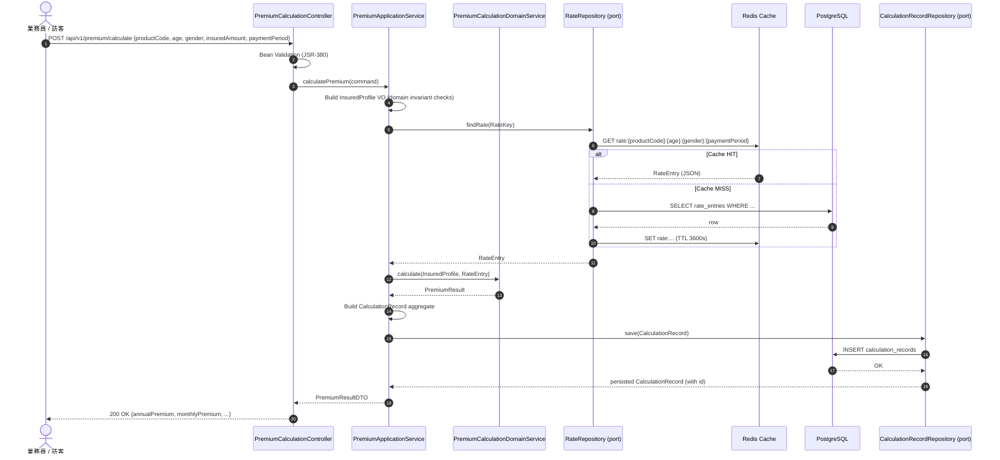
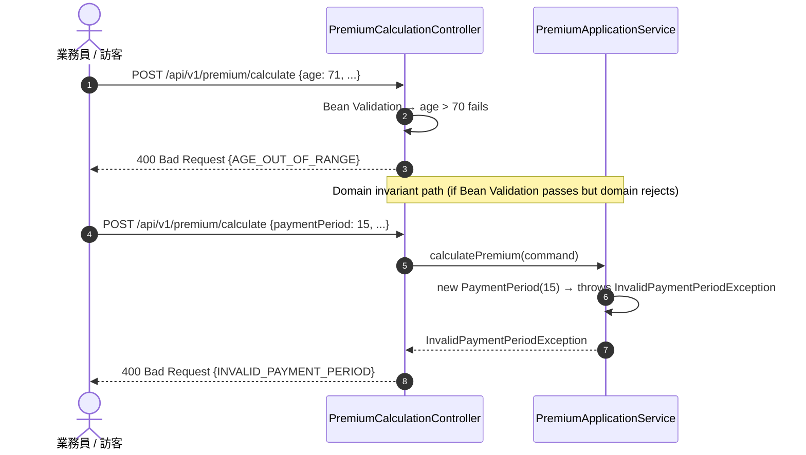
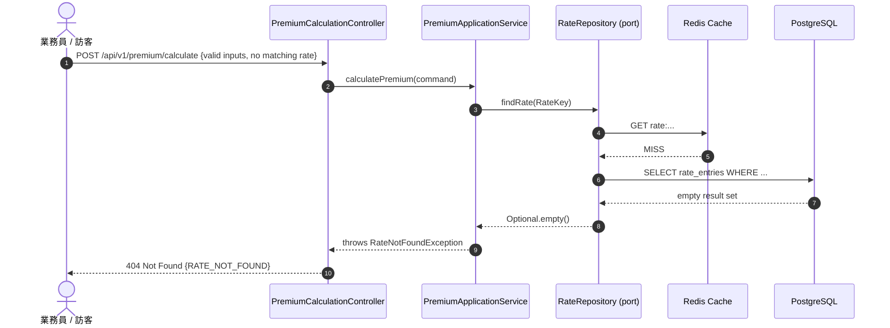
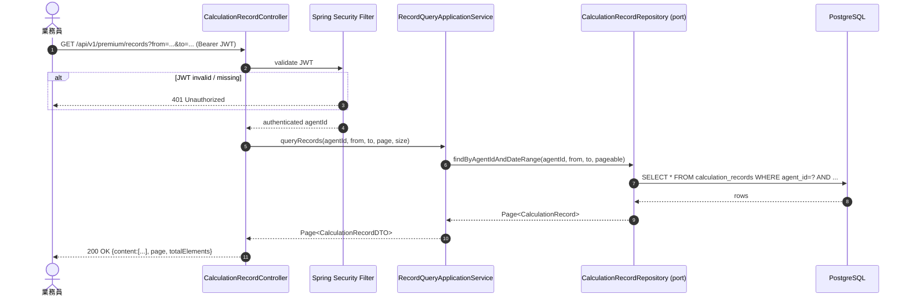
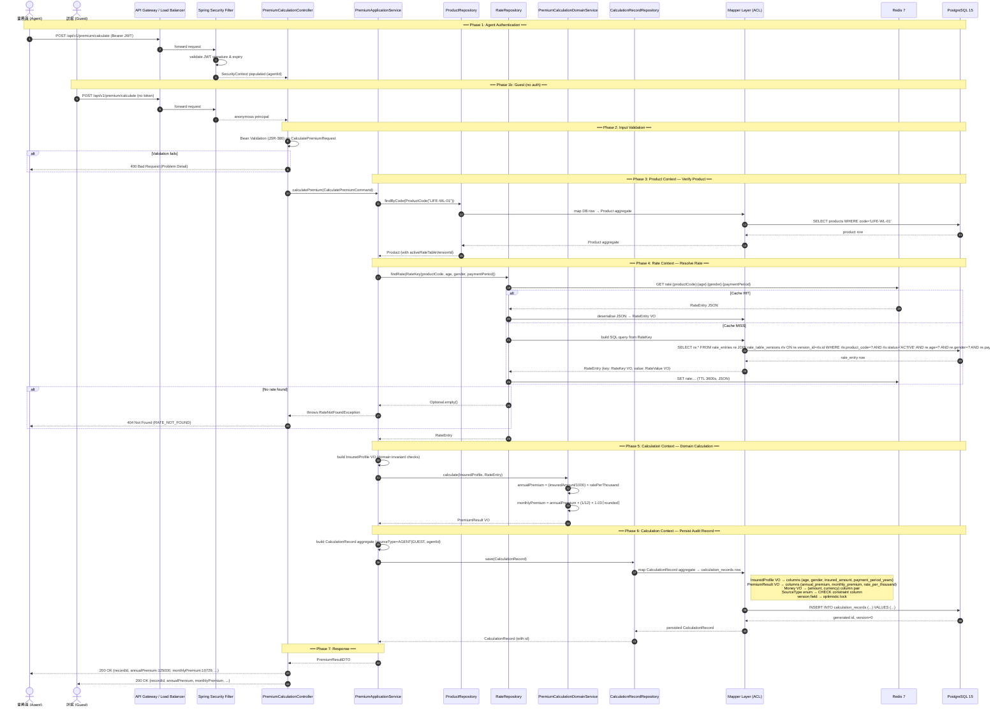

# Technical Requirements Document

**Document Number:** TRD-LIFE-v1.0
**Project Name:** 壽險新保件保費試算（Life Premium）
**Based On:** FSD-LIFE-v1.0
**Version:** 1.0
**Created:** 2026-09-08
**Status:** Draft — Pending Architecture Confirmation (see §0)

---

## 0. ⚠️ Architecture Confirmation Required

The FSD specifies Java 17 / Spring Boot 3.3 / PostgreSQL 15 / Redis 7 at the container level but leaves several architecture constraints unspecified. The following items **must be confirmed by the responsible architect before implementation begins**. Assumptions are explicitly flagged; none are silently adopted.

| # | Topic | FSD Evidence | Question / Options | Owner |
|---|-------|-------------|-------------------|-------|
| A1 | **Build Tool** | Not stated | Maven 3.9 or Gradle 8? | Architect |
| A2 | **ORM / Persistence** | "JDBC" mentioned in C4 L2 | Plain JDBC (e.g., Spring JDBC Template / JOOQ) or JPA/Hibernate? This choice directly affects the mapper layer design (§8). | Architect |
| A3 | **Authentication Mechanism** | "X-Agent-Id / JWT — SD 階段決定" | (a) Stateless JWT (Spring Security + JWT filter), (b) API-Key header `X-Agent-Id` only, (c) OAuth2 Resource Server? | Architect / Security |
| A4 | **Logging Framework** | Not stated | Logback (default Spring Boot) + SLF4J? Structured JSON logs (Logstash encoder)? Log aggregation target (ELK / CloudWatch)? | Architect |
| A5 | **Testing Framework** | Not stated | JUnit 5 + Mockito + AssertJ? Cucumber-JVM for Gherkin BDD? Testcontainers for DB integration tests? | Architect / QA |
| A6 | **API Versioning Strategy** | `/api/v1/` in FSD | URI versioning confirmed (`/api/v1/`). Confirm no header-based versioning needed. | Architect |
| A7 | **Redis Client** | "Redis Protocol" in C4 | Lettuce (Spring Boot default) or Jedis? | Architect |
| A8 | **Cache serialisation** | Not stated | JSON (Jackson) or Java serialisation for cached rate objects? | Architect |
| A9 | **Deployment Target** | Not stated | Kubernetes / Docker Compose / bare VM? Affects health-check and graceful-shutdown config. | DevOps |
| A10 | **Guest identity tracking** | FSD §7.1 FR-PREMIUM-001 "來源標記" | How is a guest identified in `CalculationRecord`? Anonymous UUID per session? No record saved for guests? | Business / Architect |

> **Process:** Each item above must receive a written decision before §3–§8 are finalised. Items marked with a proposed default below are used only as placeholders for the remainder of this document and are clearly labelled **[ASSUMED — CONFIRM A#]**.

---

## Table of Contents

1. [Project Overview](#1-project-overview)
2. [Architecture Constraints](#2-architecture-constraints)
3. [Bounded Contexts & Domain Model](#3-bounded-contexts--domain-model)
4. [REST API Specification](#4-rest-api-specification)
5. [Sequence Diagrams](#5-sequence-diagrams)
6. [Business Rules](#6-business-rules)
7. [Non-Functional Requirements](#7-non-functional-requirements)
8. [Persistence & Anti-Corruption Mapper Layer](#8-persistence--anti-corruption-mapper-layer)
9. [Caching Design](#9-caching-design)
10. [Security Design](#10-security-design)
11. [Error Handling](#11-error-handling)
12. [Testing Strategy](#12-testing-strategy)
13. [Open Items](#13-open-items)

---

## 1. Project Overview

| Attribute | Value |
|-----------|-------|
| System Name | Life Premium 試算系統 |
| MVP Scope | Single product `LIFE-WL-01` (Whole Life) |
| Core Capability | Premium calculation (annual / monthly) + audit record persistence |
| Consumers | Agent back-office, public website (guest) |
| External Integrations | None (MVP) |

---

## 2. Architecture Constraints

### 2.1 Confirmed Constraints (from FSD)

| Dimension | Constraint | Source |
|-----------|-----------|--------|
| **Language** | Java 17 (LTS) | FSD §5.2 Container table |
| **Framework** | Spring Boot **3.3.x** | FSD §5.2 Container table |
| **Database** | PostgreSQL **15** | FSD §5.2 Container table |
| **Cache** | Redis **7** | FSD §5.2 Container table |
| **API Style** | REST over HTTPS | FSD §4.3, §6.1 |
| **API Version Prefix** | `/api/v1/` | FSD §6.1 |
| **Response Time SLA** | ≤ 500 ms (p99) | FSD §8.1 |
| **Availability** | 99.5% | FSD §8.3 |
| **Audit Retention** | Permanent | FSD §10.2 |

### 2.2 Assumed Constraints **[CONFIRM A1–A10]**

| Dimension | Assumed Value | Confirmation Item |
|-----------|--------------|-------------------|
| **Build Tool** | Maven 3.9 | A1 |
| **ORM / Persistence** | Spring Data JPA (Hibernate 6) | A2 |
| **Auth** | Stateless JWT via Spring Security 6 (`Authorization: Bearer <token>`); Guest = unauthenticated | A3 |
| **Logging** | SLF4J + Logback; structured JSON via `logstash-logback-encoder` | A4 |
| **Unit Test** | JUnit 5 + Mockito + AssertJ | A5 |
| **BDD / Integration** | Cucumber-JVM 7 + Testcontainers (PostgreSQL + Redis) | A5 |
| **Redis Client** | Lettuce (Spring Boot default) | A7 |
| **Cache Serialisation** | Jackson JSON | A8 |
| **Deployment** | Docker Compose (dev) / Kubernetes (prod) | A9 |
| **Guest Record** | `CalculationRecord` saved with `sourceType = GUEST`, `agentId = null` | A10 |

---

## 3. Bounded Contexts & Domain Model

### 3.1 Bounded Context Map

```
┌─────────────────────────────────────────────────────────────────┐
│  Life Premium System                                            │
│                                                                 │
│  ┌──────────────────────┐    ┌──────────────────────────────┐  │
│  │  Rate Context        │    │  Calculation Context         │  │
│  │                      │    │                              │  │
│  │  Aggregate:          │    │  Aggregate:                  │  │
│  │  RateTable           │───▶│  PremiumCalculation          │  │
│  │  (RateTableVersion   │    │  (CalculationRecord)         │  │
│  │   + RateEntry[])     │    │                              │  │
│  │                      │    │  Domain Service:             │  │
│  │  Value Objects:      │    │  PremiumCalculationService   │  │
│  │  RateKey             │    │                              │  │
│  │  RateValue           │    │  Value Objects:              │  │
│  │                      │    │  InsuredProfile              │  │
│  │                      │    │  PremiumResult               │  │
│  │                      │    │  Money                       │  │
│  └──────────────────────┘    └──────────────────────────────┘  │
│                                                                 │
│  ┌──────────────────────┐                                       │
│  │  Product Context     │                                       │
│  │                      │                                       │
│  │  Aggregate:          │                                       │
│  │  Product             │                                       │
│  │  Value Objects:      │                                       │
│  │  ProductCode         │                                       │
│  └──────────────────────┘                                       │
└─────────────────────────────────────────────────────────────────┘
```

### 3.2 Domain Model (Persistence-Free)

> **Design Principle:** Domain objects carry **zero** JPA/JDBC annotations. All persistence concerns are handled exclusively by the mapper layer (§8).

```
// ── Product Context ──────────────────────────────────────────────

ProductCode (Value Object)
  - value: String                          // e.g. "LIFE-WL-01"
  - invariant: non-blank, matches [A-Z0-9-]{1,20}

Product (Aggregate Root)
  - id: UUID
  - code: ProductCode
  - name: String
  - activeRateTableVersionId: UUID         // FK by identity, not object ref

// ── Rate Context ─────────────────────────────────────────────────

Gender (Enum)
  - MALE, FEMALE

PaymentPeriod (Value Object)
  - years: int                             // allowed: {10, 20, 30, 99}
  - invariant: years ∈ {10,20,30,99}

RateKey (Value Object)
  - productCode: ProductCode
  - age: int                               // 0–70
  - gender: Gender
  - paymentPeriod: PaymentPeriod

RateValue (Value Object)
  - ratePerThousand: BigDecimal            // e.g. 12.50
  - invariant: > 0

RateEntry (Entity within RateTable aggregate)
  - id: UUID
  - key: RateKey
  - value: RateValue

RateTableVersion (Aggregate Root)
  - id: UUID
  - productCode: ProductCode
  - versionLabel: String                   // e.g. "2026-Q1"
  - effectiveDate: LocalDate
  - entries: List<RateEntry>
  - status: RateTableStatus                // DRAFT | ACTIVE | SUPERSEDED

RateTableStatus (Enum)
  - DRAFT, ACTIVE, SUPERSEDED

// ── Calculation Context ──────────────────────────────────────────

InsuredProfile (Value Object)
  - age: int                               // 0–70
  - gender: Gender
  - insuredAmount: Money                   // 100万–5000万
  - paymentPeriod: PaymentPeriod

Money (Value Object)
  - amount: BigDecimal
  - currency: String                       // "TWD" for MVP
  - invariant: amount >= 0

PremiumResult (Value Object)
  - annualPremium: Money
  - monthlyPremium: Money
  - ratePerThousand: RateValue
  - rateTableVersionId: UUID               // for auditability

SourceType (Enum)
  - AGENT, GUEST

CalculationRecord (Aggregate Root)
  - id: UUID
  - productCode: ProductCode
  - insuredProfile: InsuredProfile
  - result: PremiumResult
  - rateTableVersionId: UUID
  - sourceType: SourceType
  - agentId: String                        // null when sourceType=GUEST
  - calculatedAt: Instant
  - version: long                          // optimistic lock

// ── Domain Service ───────────────────────────────────────────────

PremiumCalculationDomainService
  + calculate(profile: InsuredProfile,
              rateEntry: RateEntry): PremiumResult
  // BR-004: annualPremium  = (insuredAmount / 1000) × ratePerThousand
  // BR-005: monthlyPremium = annualPremium × 1/12 × 1.03 (rounded up to whole TWD)
```

---

## 4. REST API Specification

### 4.1 Endpoints Summary

| Method | Path | Auth | Description |
|--------|------|------|-------------|
| `POST` | `/api/v1/premium/calculate` | None (Guest) / JWT (Agent) | Calculate premium |
| `GET` | `/api/v1/premium/records` | JWT (Agent only) | Query own calculation records |
| `GET` | `/api/v1/premium/records/{id}` | JWT (Agent only) | Get single record |

### 4.2 POST `/api/v1/premium/calculate`

**Request Body**

```json
{
  "productCode": "LIFE-WL-01",
  "age": 35,
  "gender": "MALE",
  "insuredAmount": 10000000,
  "paymentPeriod": 20
}
```

| Field | Type | Constraints |
|-------|------|-------------|
| `productCode` | String | Required; `LIFE-WL-01` for MVP |
| `age` | Integer | Required; 0 ≤ age ≤ 70 |
| `gender` | String | Required; `MALE` \| `FEMALE` |
| `insuredAmount` | Long | Required; 1,000,000 ≤ x ≤ 50,000,000 (TWD) |
| `paymentPeriod` | Integer | Required; ∈ {10, 20, 30, 99} |

**Response 200 OK**

```json
{
  "recordId": "550e8400-e29b-41d4-a716-446655440000",
  "productCode": "LIFE-WL-01",
  "annualPremium": 125000,
  "monthlyPremium": 10729,
  "currency": "TWD",
  "ratePerThousand": 12.50,
  "rateTableVersionId": "...",
  "calculatedAt": "2026-09-08T10:00:00Z"
}
```

**Error Responses**

| HTTP Status | Error Code | Trigger |
|-------------|-----------|---------|
| 400 | `AGE_OUT_OF_RANGE` | age < 0 or age > 70 |
| 400 | `AMOUNT_OUT_OF_RANGE` | insuredAmount out of [1M, 50M] |
| 400 | `INVALID_PAYMENT_PERIOD` | paymentPeriod ∉ {10,20,30,99} |
| 400 | `INVALID_PRODUCT_CODE` | productCode blank or unknown |
| 404 | `RATE_NOT_FOUND` | No matching RateEntry |
| 422 | `VALIDATION_FAILED` | Bean validation failure (missing fields) |
| 500 | `INTERNAL_ERROR` | Unexpected server error |

**Error Response Body (RFC 7807 Problem Detail)**

```json
{
  "type": "https://life-premium.example.com/errors/age-out-of-range",
  "title": "Age Out of Range",
  "status": 400,
  "detail": "Age 71 is outside the allowed range [0, 70].",
  "instance": "/api/v1/premium/calculate"
}
```

### 4.3 GET `/api/v1/premium/records`

**Query Parameters**

| Parameter | Type | Required | Description |
|-----------|------|----------|-------------|
| `from` | ISO-8601 date | No | Start of date range (inclusive) |
| `to` | ISO-8601 date | No | End of date range (inclusive) |
| `page` | Integer | No | Default 0 |
| `size` | Integer | No | Default 20, max 100 |

**Response 200 OK**

```json
{
  "content": [
    {
      "recordId": "...",
      "productCode": "LIFE-WL-01",
      "age": 35,
      "gender": "MALE",
      "insuredAmount": 10000000,
      "paymentPeriod": 20,
      "annualPremium": 125000,
      "monthlyPremium": 10729,
      "calculatedAt": "2026-09-08T10:00:00Z"
    }
  ],
  "page": 0,
  "size": 20,
  "totalElements": 1,
  "totalPages": 1
}
```

---

## 5. Sequence Diagrams

### 5.1 Context: Premium Calculation (FR-PREMIUM-001) — Happy Path



### 5.2 Context: Premium Calculation — Validation Failure



### 5.3 Context: Premium Calculation — Rate Not Found



### 5.4 Context: Calculation Record Query (FR-PREMIUM-002)



### 5.5 End-to-End (E2E) — Full Business Flow Across All Bounded Contexts

> This diagram traces the complete business flow from a user request through all bounded contexts (Product, Rate, Calculation) and all infrastructure components.



---

## 6. Business Rules

| Rule ID | Description | Implementation Location |
|---------|-------------|------------------------|
| BR-001 | Age must be 0–70 (inclusive) | `InsuredProfile` VO constructor + Bean Validation |
| BR-002 | `insuredAmount` must be 1,000,000–50,000,000 TWD | `InsuredProfile` VO constructor + Bean Validation |
| BR-003 | `paymentPeriod` must be ∈ {10, 20, 30, 99} | `PaymentPeriod` VO constructor + Bean Validation |
| BR-004 | `annualPremium = (insuredAmount ÷ 1,000) × ratePerThousand` | `PremiumCalculationDomainService` |
| BR-005 | `monthlyPremium = annualPremium × (1/12) × 1.03`, rounded up to nearest whole TWD | `PremiumCalculationDomainService` |
| BR-006 | Rate lookup uses the **ACTIVE** `RateTableVersion` for the given `productCode` | `RateRepository` implementation |
| BR-007 | Historical `CalculationRecord` retains `rateTableVersionId` for full auditability | `CalculationRecord` aggregate |
| BR-008 | A new `RateTableVersion` must not mutate existing `RateEntry` rows; it creates new rows under a new version | `RateTableVersion` aggregate invariant |

**BR-005 Calculation Example (Acceptance Test Anchor):**

```
insuredAmount = 10,000,000 TWD
ratePerThousand = 12.50
annualPremium = (10,000,000 / 1,000) × 12.50 = 125,000 TWD
monthlyPremium = 125,000 × (1/12) × 1.03
              = 125,000 × 0.08583...
              = 10,729.17... → ⌈10,730⌉ TWD

⚠️ CONFIRM: FSD acceptance criterion states monthlyPremium = 10,729.
Rounding rule (ceiling vs. round-half-up) must be confirmed with business.
```

> **Flag BR-005-ROUNDING:** The FSD states `monthlyPremium = 10,729` for the given inputs. With ceiling rounding the result is 10,730. **Business must confirm the exact rounding rule before implementation.**

---

## 7. Non-Functional Requirements

### 7.1 Performance

| Metric | Target | Measurement Point |
|--------|--------|------------------|
| API response time | ≤ 500 ms (p99) | At API Gateway |
| Cache hit ratio | ≥ 80% (steady state) | Redis INFO stats |
| DB query time | ≤ 50 ms (p99) | Application metrics |

### 7.2 Availability

- Target: **99.5%** monthly uptime
- Health check endpoint: `GET /actuator/health` (Spring Boot Actuator)
- Graceful shutdown: `spring.lifecycle.timeout-per-shutdown-phase=30s`

### 7.3 Security

- All endpoints served over **HTTPS only** (TLS 1.2+)
- Agent endpoints require valid JWT (`Authorization: Bearer <token>`) **[CONFIRM A3]**
- Guest endpoints: no auth required; rate limiting applied at gateway level
- `CalculationRecord` query enforces `agentId` from JWT claim — agents cannot query other agents' records
- No PII stored beyond `agentId` (opaque identifier)

### 7.4 Observability

- **Structured logging** (JSON) with fields: `traceId`, `spanId`, `agentId`, `productCode`, `durationMs` **[CONFIRM A4]**
- **Metrics** via Micrometer → Prometheus: `premium.calculation.duration`, `premium.calculation.count`, `rate.cache.hit`, `rate.cache.miss`
- **Distributed tracing**: Spring Boot Actuator + Micrometer Tracing (Brave/Zipkin) **[CONFIRM A9]**

### 7.5 Data Integrity

- Optimistic locking on `CalculationRecord` (version column, see §8)
- `RateEntry` rows are **immutable** after creation (no UPDATE permitted)
- Database-level `CHECK` constraints enforce enum values (see §8.3)

---

## 8. Persistence & Anti-Corruption Mapper Layer

> **Design Principle:** The customer's relational schema is kept **exactly as defined**. Domain aggregates and value objects carry **no persistence annotations**. A dedicated mapper layer (anti-corruption layer, ACL) is the sole translation boundary between domain objects and table records.

### 8.1 Database Schema (Customer Schema — Unchanged)

```sql
-- ── Product Context ──────────────────────────────────────────────

CREATE TABLE products (
    id              UUID PRIMARY KEY DEFAULT gen_random_uuid(),
    code            VARCHAR(20)  NOT NULL UNIQUE,
    name            VARCHAR(100) NOT NULL,
    active_rate_table_version_id UUID,
    created_at      TIMESTAMPTZ  NOT NULL DEFAULT now(),
    updated_at      TIMESTAMPTZ  NOT NULL DEFAULT now(),
    version         BIGINT       NOT NULL DEFAULT 0
);

-- ── Rate Context ─────────────────────────────────────────────────

CREATE TABLE rate_table_versions (
    id              UUID PRIMARY KEY DEFAULT gen_random_uuid(),
    product_code    VARCHAR(20)  NOT NULL REFERENCES products(code),
    version_label   VARCHAR(50)  NOT NULL,
    effective_date  DATE         NOT NULL,
    status          VARCHAR(20)  NOT NULL DEFAULT 'DRAFT',
    created_at      TIMESTAMPTZ  NOT NULL DEFAULT now(),
    version         BIGINT       NOT NULL DEFAULT 0,
    CONSTRAINT chk_rtv_status CHECK (status IN ('DRAFT','ACTIVE','SUPERSEDED')),
    UNIQUE (product_code, version_label)
);

CREATE TABLE rate_entries (
    id                  UUID PRIMARY KEY DEFAULT gen_random_uuid(),
    rate_table_version_id UUID NOT NULL REFERENCES rate_table_versions(id),
    age                 SMALLINT     NOT NULL,
    gender              VARCHAR(10)  NOT NULL,
    payment_period_years SMALLINT    NOT NULL,
    rate_per_thousand   NUMERIC(10,4) NOT NULL,
    CONSTRAINT chk_re_gender  CHECK (gender IN ('MALE','FEMALE')),
    CONSTRAINT chk_re_age     CHECK (age BETWEEN 0 AND 70),
    CONSTRAINT chk_re_period  CHECK (payment_period_years IN (10,20,30,99)),
    CONSTRAINT chk_re_rate    CHECK (rate_per_thousand > 0),
    UNIQUE (rate_table_version_id, age, gender, payment_period_years)
);

-- ── Calculation Context ──────────────────────────────────────────

CREATE TABLE calculation_records (
    id                      UUID PRIMARY KEY DEFAULT gen_random_uuid(),
    product_code            VARCHAR(20)   NOT NULL,
    age                     SMALLINT      NOT NULL,
    gender                  VARCHAR(10)   NOT NULL,
    insured_amount          NUMERIC(15,0) NOT NULL,
    insured_amount_currency VARCHAR(3)    NOT NULL DEFAULT 'TWD',
    payment_period_years    SMALLINT      NOT NULL,
    annual_premium          NUMERIC(15,0) NOT NULL,
    annual_premium_currency VARCHAR(3)    NOT NULL DEFAULT 'TWD',
    monthly_premium         NUMERIC(15,0) NOT NULL,
    monthly_premium_currency VARCHAR(3)   NOT NULL DEFAULT 'TWD',
    rate_per_thousand       NUMERIC(10,4) NOT NULL,
    rate_table_version_id   UUID          NOT NULL REFERENCES rate_table_versions(id),
    source_type             VARCHAR(10)   NOT NULL,
    agent_id                VARCHAR(100),
    calculated_at           TIMESTAMPTZ   NOT NULL DEFAULT now(),
    version                 BIGINT        NOT NULL DEFAULT 0,
    CONSTRAINT chk_cr_gender      CHECK (gender IN ('MALE','FEMALE')),
    CONSTRAINT chk_cr_source_type CHECK (source_type IN ('AGENT','GUEST')),
    CONSTRAINT chk_cr_age         CHECK (age BETWEEN 0 AND 70),
    CONSTRAINT chk_cr_period      CHECK (payment_period_years IN (10,20,30,99))
);

CREATE INDEX idx_cr_agent_calculated ON calculation_records(agent_id, calculated_at DESC);
CREATE INDEX idx_re_lookup ON rate_entries(rate_table_version_id, age, gender, payment_period_years);
```

### 8.2 Mapper Layer Architecture

```
┌─────────────────────────────────────────────────────────────────────┐
│  Application Layer                                                  │
│  PremiumApplicationService                                          │
│       │ uses domain ports (interfaces)                              │
│       ▼                                                             │
│  ┌─────────────────────────────────────────────────────────────┐   │
│  │  Domain Ports (interfaces, in domain module)                │   │
│  │  RateRepository          : findRate(RateKey) → Optional<RateEntry>│
│  │  CalculationRecordRepository : save(CalculationRecord)      │   │
│  │  ProductRepository       : findByCode(ProductCode)          │   │
│  └─────────────────────────────────────────────────────────────┘   │
│       │ implemented by                                              │
│       ▼                                                             │
│  ┌─────────────────────────────────────────────────────────────┐   │
│  │  Infrastructure / Mapper Layer (anti-corruption)            │   │
│  │                                                             │   │
│  │  JpaRateRepository        implements RateRepository         │   │
│  │    └── RateEntryMapper    (RateEntry ↔ rate_entries row)    │   │
│  │                                                             │   │
│  │  JpaCalculationRecordRepository  implements ...Repository   │   │
│  │    └── CalculationRecordMapper                              │   │
│  │         (CalculationRecord aggregate ↔ calculation_records) │   │
│  │                                                             │   │
│  │  JpaProductRepository     implements ProductRepository      │   │
│  │    └── ProductMapper      (Product ↔ products row)          │   │
│  └─────────────────────────────────────────────────────────────┘   │
│       │ uses                                                        │
│       ▼                                                             │
│  JPA Entities (infrastructure module, annotated with @Entity)       │
│  ProductJpaEntity, RateTableVersionJpaEntity,                       │
│  RateEntryJpaEntity, CalculationRecordJpaEntity                     │
└─────────────────────────────────────────────────────────────────────┘
```

### 8.3 Mapper Specifications

#### 8.3.1 `CalculationRecordMapper` — Aggregate ↔ Multiple Columns

This is the most complex mapper because `CalculationRecord` contains nested value objects that map to column groups.

```
Domain Object                          DB Column(s)
─────────────────────────────────────────────────────────────────────
CalculationRecord.id                → calculation_records.id
CalculationRecord.productCode.value → calculation_records.product_code
CalculationRecord.calculatedAt      → calculation_records.calculated_at
CalculationRecord.sourceType        → calculation_records.source_type  (enum → VARCHAR CHECK)
CalculationRecord.agentId           → calculation_records.agent_id     (nullable)
CalculationRecord.rateTableVersionId→ calculation_records.rate_table_version_id
CalculationRecord.version           → calculation_records.version      (optimistic lock)

InsuredProfile (Value Object) ↔ Column Group:
  InsuredProfile.age                → calculation_records.age
  InsuredProfile.gender             → calculation_records.gender        (enum → VARCHAR CHECK)
  InsuredProfile.insuredAmount.amount   → calculation_records.insured_amount
  InsuredProfile.insuredAmount.currency → calculation_records.insured_amount_currency
  InsuredProfile.paymentPeriod.years    → calculation_records.payment_period_years

PremiumResult (Value Object) ↔ Column Group:
  PremiumResult.annualPremium.amount    → calculation_records.annual_premium
  PremiumResult.annualPremium.currency  → calculation_records.annual_premium_currency
  PremiumResult.monthlyPremium.amount   → calculation_records.monthly_premium
  PremiumResult.monthlyPremium.currency → calculation_records.monthly_premium_currency
  PremiumResult.ratePerThousand.ratePerThousand → calculation_records.rate_per_thousand
```

**Enum → CHECK Constraint Mapping:**

| Domain Enum | Domain Value | DB Column Value | DB CHECK Constraint |
|-------------|-------------|-----------------|---------------------|
| `Gender.MALE` | `MALE` | `'MALE'` | `CHECK (gender IN ('MALE','FEMALE'))` |
| `Gender.FEMALE` | `FEMALE` | `'FEMALE'` | same |
| `SourceType.AGENT` | `AGENT` | `'AGENT'` | `CHECK (source_type IN ('AGENT','GUEST'))` |
| `SourceType.GUEST` | `GUEST` | `'GUEST'` | same |
| `RateTableStatus.DRAFT` | `DRAFT` | `'DRAFT'` | `CHECK (status IN ('DRAFT','ACTIVE','SUPERSEDED'))` |

**Optimistic Lock Carry-Through:**

```
On INSERT:
  CalculationRecord.version = 0
  → INSERT ... version = 0

On UPDATE (if ever needed for status changes):
  JPA @Version on CalculationRecordJpaEntity.version
  → UPDATE ... WHERE id=? AND version=?
  → If 0 rows updated → throw OptimisticLockException → HTTP 409

On READ → toDomain():
  CalculationRecordJpaEntity.version → CalculationRecord.version
  (carried through so any subsequent save preserves the lock token)
```

#### 8.3.2 `RateEntryMapper` — Entity ↔ Value Objects

```
RateEntryJpaEntity                     RateEntry (domain)
─────────────────────────────────────────────────────────
id                                  → id: UUID
rate_table_version_id               → (used for lookup, not in RateEntry itself)
age + gender + payment_period_years → key: RateKey(ProductCode, age, Gender, PaymentPeriod)
rate_per_thousand                   → value: RateValue(ratePerThousand)
```

> Note: `RateKey.productCode` is resolved via the joined `rate_table_versions.product_code` column in the lookup query — it is **not** stored redundantly in `rate_entries`.

#### 8.3.3 `ProductMapper`

```
ProductJpaEntity                       Product (domain)
─────────────────────────────────────────────────────────
id                                  → id: UUID
code                                → code: ProductCode(value)
name                                → name: String
active_rate_table_version_id        → activeRateTableVersionId: UUID
version                             → version: long (optimistic lock)
```

### 8.4 Transaction Boundary

```
PremiumApplicationService.calculatePremium()
  @Transactional(isolation = READ_COMMITTED)
  ├── ProductRepository.findByCode()          [read]
  ├── RateRepository.findRate()               [read, may populate cache]
  ├── PremiumCalculationDomainService.calculate()  [pure domain, no I/O]
  └── CalculationRecordRepository.save()      [write — single INSERT]
      └── CalculationRecordMapper.toJpaEntity()
          └── maps aggregate + all nested VOs → single row INSERT
```

> The entire flow is one transaction. The `CalculationRecord` INSERT and any cache write are **not** in the same transaction (cache is updated after commit via `@TransactionalEventListener` or post-commit hook to avoid cache poisoning on rollback).

### 8.5 Mapper Implementation Pattern

```java
// Example — CalculationRecordMapper (infrastructure layer)
// Domain objects have NO JPA annotations.

@Component
public class CalculationRecordMapper {

    public CalculationRecordJpaEntity toJpaEntity(CalculationRecord domain) {
        CalculationRecordJpaEntity entity = new CalculationRecordJpaEntity();
        entity.setId(domain.getId());
        entity.setProductCode(domain.getProductCode().getValue());
        entity.setAge((short) domain.getInsuredProfile().getAge());
        entity.setGender(domain.getInsuredProfile().getGender().name());
        entity.setInsuredAmount(domain.getInsuredProfile().getInsuredAmount().getAmount());
        entity.setInsuredAmountCurrency(domain.getInsuredProfile().getInsuredAmount().getCurrency());
        entity.setPaymentPeriodYears((short) domain.getInsuredProfile().getPaymentPeriod().getYears());
        entity.setAnnualPremium(domain.getResult().getAnnualPremium().getAmount());
        entity.setAnnualPremiumCurrency(domain.getResult().getAnnualPremium().getCurrency());
        entity.setMonthlyPremium(domain.getResult().getMonthlyPremium().getAmount());
        entity.setMonthlyPremiumCurrency(domain.getResult().getMonthlyPremium().getCurrency());
        entity.setRatePerThousand(domain.getResult().getRatePerThousand().getRatePerThousand());
        entity.setRateTableVersionId(domain.getRateTableVersionId());
        entity.setSourceType(domain.getSourceType().name());
        entity.setAgentId(domain.getAgentId());
        entity.setCalculatedAt(domain.getCalculatedAt());
        entity.setVersion(domain.getVersion());          // optimistic lock
        return entity;
    }

    public CalculationRecord toDomain(CalculationRecordJpaEntity entity) {
        InsuredProfile profile = new InsuredProfile(
            entity.getAge(),
            Gender.valueOf(entity.getGender()),
            new Money(entity.getInsuredAmount(), entity.getInsuredAmountCurrency()),
            new PaymentPeriod(entity.getPaymentPeriodYears())
        );
        PremiumResult result = new PremiumResult(
            new Money(entity.getAnnualPremium(), entity.getAnnualPremiumCurrency()),
            new Money(entity.getMonthlyPremium(), entity.getMonthlyPremiumCurrency()),
            new RateValue(entity.getRatePerThousand()),
            entity.getRateTableVersionId()
        );
        return CalculationRecord.reconstitute(   // factory method, bypasses invariant checks
            entity.getId(),
            new ProductCode(entity.getProductCode()),
            profile,
            result,
            entity.getRateTableVersionId(),
            SourceType.valueOf(entity.getSourceType()),
            entity.getAgentId(),
            entity.getCalculatedAt(),
            entity.getVersion()                  // optimistic lock carried through
        );
    }
}
```

---

## 9. Caching Design

### 9.1 Cache-Aside Pattern for Rate Entries

| Attribute | Value |
|-----------|-------|
| Cache Key | `rate:{productCode}:{age}:{gender}:{paymentPeriod}` |
| TTL | 3600 seconds (1 hour) |
| Serialisation | Jackson JSON **[CONFIRM A8]** |
| Eviction on Rate Update | Manual eviction via `RateTableVersion` activation event (pattern delete `rate:{productCode}:*`) |
| Null caching | Cache `RATE_NOT_FOUND` sentinel for 60s to prevent DB stampede |

### 9.2 Cache Invalidation

When a new `RateTableVersion` is activated (status → `ACTIVE`), the application must:
1. Set previous version status → `SUPERSEDED`
2. Evict all cache keys matching `rate:{productCode}:*`
3. This is handled in `RateTableVersionApplicationService.activateVersion()` post-commit

---

## 10. Security Design

### 10.1 Authentication **[CONFIRM A3]**

| Endpoint | Auth Requirement |
|----------|-----------------|
| `POST /api/v1/premium/calculate` | Optional JWT; if present, `sourceType=AGENT`; if absent, `sourceType=GUEST` |
| `GET /api/v1/premium/records` | Mandatory JWT |
| `GET /api/v1/premium/records/{id}` | Mandatory JWT |

### 10.2 Authorisation

- `CalculationRecord` query: `WHERE agent_id = :agentIdFromJwt` — enforced at repository level, not just service level
- No role-based access control required for MVP

### 10.3 Input Sanitisation

- All string inputs validated via Bean Validation (`@Pattern`, `@Size`)
- `productCode` validated against allowlist (`LIFE-WL-01` for MVP)
- SQL injection prevented by parameterised queries (JPA / Spring Data)

---

## 11. Error Handling

### 11.1 Exception Hierarchy

```
RuntimeException
└── LifePremiumException (base)
    ├── ValidationException (400)
    │   ├── AgeOutOfRangeException
    │   ├── AmountOutOfRangeException
    │   └── InvalidPaymentPeriodException
    ├── NotFoundException (404)
    │   └── RateNotFoundException
    └── ConflictException (409)
        └── OptimisticLockConflictException
```

### 11.2 Global Exception Handler

`@RestControllerAdvice` maps each exception to RFC 7807 `ProblemDetail` (Spring 6 native support).

| Exception | HTTP Status | Error Code |
|-----------|-------------|-----------|
| `AgeOutOfRangeException` | 400 | `AGE_OUT_OF_RANGE` |
| `AmountOutOfRangeException` | 400 | `AMOUNT_OUT_OF_RANGE` |
| `InvalidPaymentPeriodException` | 400 | `INVALID_PAYMENT_PERIOD` |
| `MethodArgumentNotValidException` | 422 | `VALIDATION_FAILED` |
| `RateNotFoundException` | 404 | `RATE_NOT_FOUND` |
| `OptimisticLockConflictException` | 409 | `OPTIMISTIC_LOCK_CONFLICT` |
| `Exception` (catch-all) | 500 | `INTERNAL_ERROR` |

---

## 12. Testing Strategy

**[CONFIRM A5 — all framework choices below are assumed]**

### 12.1 Test Pyramid

```
        ┌──────────────┐
        │   E2E / BDD  │  Cucumber-JVM + Testcontainers (full stack)
        ├──────────────┤
        │ Integration  │  @SpringBootTest slice tests + Testcontainers
        ├──────────────┤
        │  Unit Tests  │  JUnit 5 + Mockito + AssertJ (domain + mappers)
        └──────────────┘
```

### 12.2 Unit Tests

| Target | Framework | Coverage Requirement |
|--------|-----------|---------------------|
| Domain Value Objects (invariants) | JUnit 5 + AssertJ | 100% branch |
| `PremiumCalculationDomainService` | JUnit 5 + AssertJ | 100% branch |
| Mapper Layer (`CalculationRecordMapper`, etc.) | JUnit 5 + AssertJ | 100% line |
| Application Services | JUnit 5 + Mockito | 80%+ branch |

**Key Unit Test Cases (from FSD Acceptance Criteria):**

```gherkin
Scenario: Correct premium calculation
  Given age=35, gender=MALE, insuredAmount=10000000, paymentPeriod=20, ratePerThousand=12.50
  When PremiumCalculationDomainService.calculate() is called
  Then annualPremium = 125000 TWD
  And  monthlyPremium = 10729 TWD  [CONFIRM BR-005-ROUNDING]

Scenario: Age boundary — upper limit
  Given age=70
  When InsuredProfile is constructed
  Then no exception is thrown

Scenario: Age boundary — over limit
  Given age=71
  When InsuredProfile is constructed
  Then AgeOutOfRangeException is thrown

Scenario: Invalid payment period
  Given paymentPeriod=15
  When PaymentPeriod is constructed
  Then InvalidPaymentPeriodException is thrown
```

### 12.3 Integration Tests

| Test Class | Scope | Infrastructure |
|-----------|-------|---------------|
| `RateRepositoryIntegrationTest` | Cache-aside: hit/miss/eviction | Testcontainers (PostgreSQL + Redis) |
| `CalculationRecordRepositoryIntegrationTest` | INSERT + optimistic lock | Testcontainers (PostgreSQL) |
| `PremiumCalculationControllerIntegrationTest` | Full HTTP slice | `@WebMvcTest` + Mockito |

### 12.4 BDD / Acceptance Tests

Cucumber-JVM feature files mapped from FSD §13:

| Feature File | Scenarios | FR |
|-------------|-----------|-----|
| `premium-calculation.feature` | 6 (from FSD) | FR-PREMIUM-001 |
| `record-query.feature` | 3 (auth, date range, pagination) | FR-PREMIUM-002 |

### 12.5 Performance Tests

- Tool: Gatling or k6 **[CONFIRM A9]**
- Target: ≤ 500 ms p99 at 50 concurrent users
- Scenario: `POST /api/v1/premium/calculate` with warm cache

---

## 13. Open Items

| ID | Item | Priority | Owner | Due |
|----|------|----------|-------|-----|
| A1 | Confirm build tool (Maven vs Gradle) | High | Architect | Before Sprint 1 |
| A2 | Confirm ORM (JPA vs JOOQ vs plain JDBC) | High | Architect | Before Sprint 1 |
| A3 | Confirm auth mechanism (JWT vs API-Key) | High | Architect / Security | Before Sprint 1 |
| A4 | Confirm logging target and format | Medium | Architect | Before Sprint 1 |
| A5 | Confirm test frameworks (JUnit5 / Cucumber / Testcontainers) | High | Architect / QA | Before Sprint 1 |
| A6 | Confirm URI versioning only | Low | Architect | Before Sprint 1 |
| A7 | Confirm Redis client (Lettuce vs Jedis) | Low | Architect | Before Sprint 1 |
| A8 | Confirm cache serialisation format | Low | Architect | Before Sprint 1 |
| A9 | Confirm deployment target | Medium | DevOps | Before Sprint 1 |
| A10 | Confirm guest record policy (save or discard) | High | Business | Before Sprint 1 |
| BR-005-ROUNDING | Confirm monthly premium rounding rule (ceiling vs round-half-up) — FSD states 10,729 but ceiling gives 10,730 | **Critical** | Business / Actuary | Before Sprint 1 |
| BR-002-UNIT | Confirm insuredAmount unit in API: TWD absolute value (10,000,000) or 萬 (1,000)? FSD uses both notations | High | Business | Before Sprint 1 |

---

*End of TRD-LIFE-v1.0*